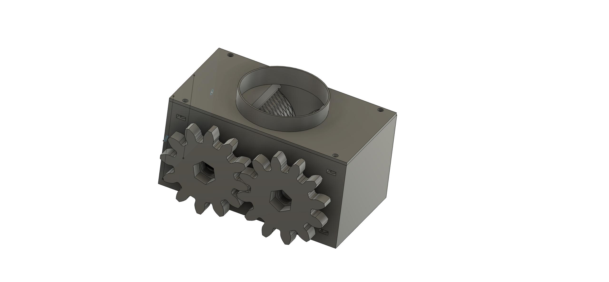

# 3D Printer Malt Mill

I designed this malt mill from scratch but took inspiration from [https://github.com/xblax/3d_printed_malt_mill](https://github.com/xblax/3d_printed_malt_mill). I printed the malt mill by xblax, but I found several issues and limitations, ranging from the roller size too small to inconsistent use of screw thread sizes. So made several improvements:

1. Bigger rollers: meaning malt will get crushed easier, and malt will be fed to the rollers more easily as well.
2. Smaller gaps: reduce the chance of malt getting into gaps, which halt the operation of the mill.
3. Only M3 & M8: M3 screw for all structural connections, and M8 for the axles.

## Features

1. 50x50 rollers with 608 bearings
2. Adjustable gaps(1mm to 2.5mm)
3. Hopper attachment (please use the funnel designed by xblax as I haven't got the time to design my own [https://github.com/xblax/3d_printed_malt_mill/blob/master/stl/funnel_no_thread.stl](https://github.com/xblax/3d_printed_malt_mill/blob/master/stl/funnel_no_thread.stl))
4. Powered by cordless screwdriver

## BOM

You will need PLA or PETG, but I recommend to use PLA as it's food-safe.

### Non-printed parts

Item  | Quantity  | Purpose
------|-----------|---------
M8 Hex Socket Cap Screw, at least length 90 (recommended 100mm)| 2 | Axles
M3 Hex Socket Cap Screw, 25mm | 2 | Adjustment screws
M3 Hex Socket Cap Screwn, 14mm (max. 18mm) | 4 | Hopper attachment screws
M3 Hex Nut or Square Nut (both will work) | 6 | For screws' stability

### Printed parts

Item | Quantity
-----|----------
Frame | 1
Rollers | 2
Gears | 2
Adapter | 1
Funnel | 1

## Printing guide

+ You probably will be fine with 10% in-fill, but I recommend at least 15%.
+ Frame should be printed upside-down.
+ Organic supports should be enabled everywhere.
+ Stars in-fill is recommended.
+ 3 perimeters, 3 top/bottom layers.

## License

The project is released under [MIT License](https://opensource.org/license/mit).
